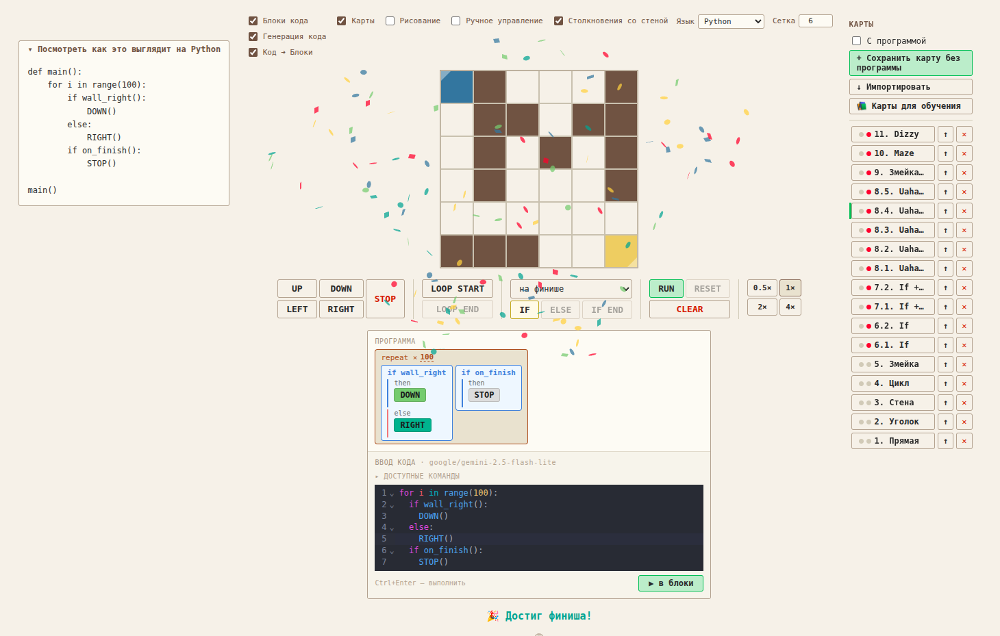
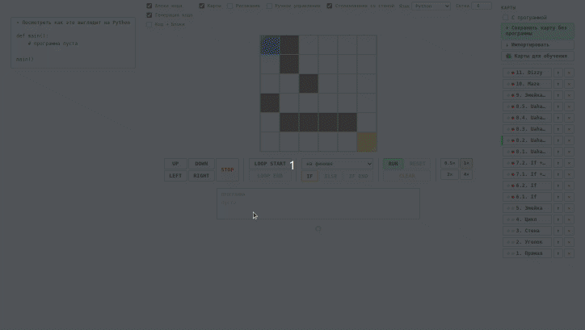

# Stepwise

🔗 **[stepwise-ed.vercel.app](https://stepwise-ed.vercel.app/?utm_source=github&utm_content=readme_top)**

Stepwise — это инструмент для первых шагов в алгоритмическом мышлении и плавного перехода к написанию кода.

Ученик сначала решает задачу через блоки, затем видит тот же алгоритм в выбранном языке, а потом постепенно переходит к самостоятельному написанию кода.



## Для кого

Stepwise может быть полезен:

- преподавателям
- репетиторам
- родителям
- всем, кто хочет мягко ввести ученика в циклы, условия и базовый синтаксис

## Идея

Stepwise — это не просто визуальный конструктор. Его основная идея — постепенный переход:

**ручное управление → блоки → синтаксис языка → написание кода**

То есть ученик не сталкивается с синтаксисом сразу. Сначала он понимает смысл конструкции, затем видит её запись в языке, и только после этого начинает писать код сам.

## Как это работает



Робот должен добраться до финиша. Ученик не управляет им напрямую, а составляет программу из команд движения, циклов и условий, а затем запускает её.

В Stepwise есть три режима, которые можно вводить постепенно:

### 1. Блоки кода

Основной режим. Никакого синтаксиса — только логика.

### 2. Генерация кода

Панель слева показывает, как текущая программа выглядит на выбранном языке:

- Python
- C
- C++
- Java
- C#
- JavaScript

Этот режим удобно включать в середине обучения, чтобы ученик видел связь между блоками и реальным кодом.

### 3. Код ➜ Блоки

Финальный режим. Ученик пишет код, а система сопоставляет его со знакомыми блоками и запускает программу.

## Быстрый старт

1. Открой [stepwise-ed.vercel.app](https://stepwise-ed.vercel.app/?utm_source=github&utm_content=readme_quick_start)
2. Включи чекбокс "Карты" и импортируй учебные карты (📚 Карты для обучения в сайдбаре справа)
3. Выбери одну из встроенных карт
4. Собери программу из блоков
5. Запусти программу `RUN`
6. Когда базовая логика станет понятной, включи генерацию кода
7. Напиши код самостоятельно в режиме `Код ➜ Блоки`

## Что умеет Stepwise

- ручное перемещение робота по карте
- составление программы из блоков
- циклы и условия
- перевод блоков в код
- перевод кода в блоки
- встроенные обучающие карты
- создание собственных карт
- сохранение, экспорт и импорт карт

## Управление

Основные блоки:

- `UP` `DOWN` `LEFT` `RIGHT` — движение
- `LOOP START` / `LOOP END` — цикл
- `IF` / `ELSE` / `IF END` — условие
- `STOP` — остановить программу (для остановки на финише)

Служебные кнопки:

- `RUN` — запустить программу
- `RESET` — остановить программу
- `CLEAR` — очистить программу
- `0.5×` `1×` `2×` `4×` — скорость движения робота

Чекбоксы в шапке позволяют скрывать и показывать панели, чтобы преподаватель мог оставить на экране только то, что нужно на текущем этапе.

## Карты

Встроенные обучающие карты разбиты по нарастающей сложности.

Некоторые карты специально объединены в пары или серии: ожидается, что они будут решены одним и тем же алгоритмом. Это помогает ученику увидеть не просто решение конкретной карты, а алгоритм, который решает целый класс задач (карт).

| Карты            | Тема                                                   |
| ---------------- | ------------------------------------------------------ |
| 1–3              | Базовые движения                                       |
| 4–5              | Циклы                                                  |
| 6–7              | Условия (каждая пара решается **одним** алгоритмом)    |
| 8.1–8.5 «Uahaha» | Сложные условия (все пять карт — **одним** алгоритмом) |
| 9. Змейка BIG    | Большая карта 20×20, вложенные циклы                   |
| 10. Maze         | Лабиринт, свободный маршрут                            |
| 11. Dizzy        | Финальная карта — спираль 20×20                        |

Карты можно сохранять, экспортировать и импортировать. Также собственные карты можно рисовать прямо в интерфейсе.

📖 Подробные советы по проведению занятий — в [lesson_tips.md](lesson_tips.md)

## Что важно понимать

Stepwise не заменяет преподавателя и сам по себе не гарантирует результат.

Лучше всего он работает как среда для разговора, совместного поиска решения и аккуратного перехода к коду.

Режим `Код ➜ Блоки` использует LLM и поэтому не гарантирует идеальный разбор любого пользовательского кода.

## Стек

- React + TypeScript + Vite
- [@dnd-kit](https://dndkit.com) — drag & drop блоков
- [CodeMirror 6](https://codemirror.net) — редактор кода
- [OpenRouter](https://openrouter.ai) — LLM для режима `Код ➜ Блоки`
- [Vercel](https://vercel.com/) — lambda / деплой

## Локальная разработка

```bash
pnpm install
pnpm dev
```

Для работы Код ➜ Блоки создай `.env.local`:

```
OPENROUTER_API_KEY=sk-or-v1-...
```

Запуск с API:

```bash
pnpm d   # dotenv -e .env.local -- vercel dev
```
