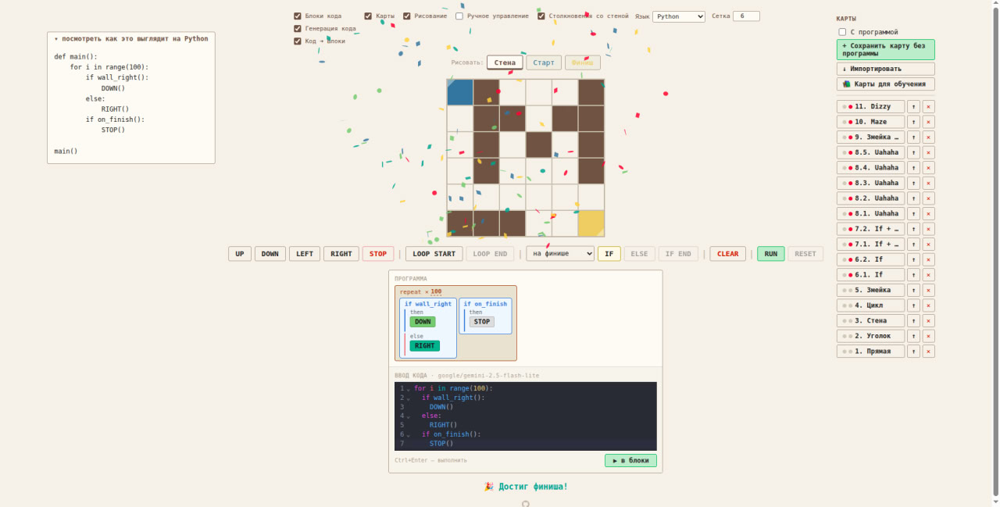

# Stepwise

Инструмент для раннего обучения программированию. Ученик управляет роботом на сетке — сначала кнопками, затем блоками кода, затем пишет настоящий код.

🔗 **[stepwise-ed.vercel.app](https://stepwise-ed.vercel.app)**



---

## Как это работает

Робот стоит на сетке и должен добраться до финиша. Ученик составляет программу из команд движения, циклов и условий — и запускает её.

Три режима работы, которые постепенно вводятся в процессе обучения:

**Блоки кода** — основной режим. Никакого синтаксиса — только логика.

**Генерация кода** — панель слева показывает, как текущая программа выглядит на выбранном языке (Python, C, C++, Java, C#, JavaScript). Включается в середине курса, чтобы ученик видел связь между блоками и реальным кодом.

**Код ➜ Блоки** — ученик пишет код в редакторе, нейросеть переводит его в блоки и запускает. Финальный этап курса.

---

## Управление

| Элемент                    | Описание                        |
| -------------------------- | ------------------------------- |
| `UP` `DOWN` `LEFT` `RIGHT` | Команды движения                |
| `LOOP START` / `LOOP END`  | Цикл `repeat ×N`                |
| `IF` / `ELSE` / `IF END`   | Условный блок                   |
| `STOP`                     | Остановить выполнение           |
| `RUN`                      | Запустить программу             |
| `RESET`                    | Остановить запущенную программу |
| `CLEAR`                    | Очистить программу              |

Чекбоксы в шапке управляют видимостью панелей — учитель может показывать только то, что нужно на данном этапе.

---

## Карты

Встроенные обучающие карты разбиты на блоки по нарастающей сложности:

| Карты            | Тема                                                       |
| ---------------- | ---------------------------------------------------------- |
| 1–3              | Базовые движения                                           |
| 4–5              | Циклы                                                      |
| 6–7              | Условия (важно: каждая пара решается **одним** алгоритмом) |
| 8.1–8.5 «Uahaha» | Сложные условия (все пять — **одним** алгоритмом)          |
| 9. Змейка BIG    | Большая карта 20×20, сила цикла                            |
| 10. Maze         | Лабиринт, свободный маршрут                                |
| 11. Dizzy        | Финальная карта — спираль 20×20                            |

Карты можно сохранять, экспортировать и импортировать. Также можно рисовать собственные карты прямо в интерфейсе.

📖 Подробные советы по проведению занятий — в [lesson_tips.md](lesson_tips.md)

---

## Стек

- React + TypeScript + Vite
- [@dnd-kit](https://dndkit.com) — drag & drop блоков
- [CodeMirror 6](https://codemirror.net) — редактор кода
- [OpenRouter](https://openrouter.ai) — перевод кода в блоки
- Vercel — деплой

---

## Локальная разработка

```bash
pnpm install
pnpm dev
```

Для работы Код ➜ Блоки создай `.env.local`:

```
OPENROUTER_API_KEY=sk-or-v1-...
```

Запуск с API:

```bash
pnpm d   # dotenv -e .env.local -- vercel dev
```
